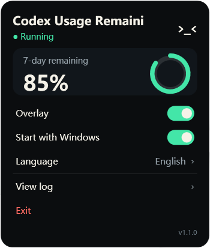
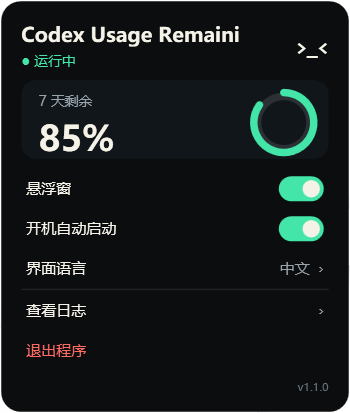
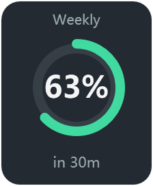

<!-- markdownlint-disable MD033 MD036 MD032 -->
# Codex Usage Remaining

<p align="center">
  
  
  
  
</p>

<p align="center">
  _< face"/>
</p>

> Show remaining usage next to Codex Desktop `/pet`, with quick controls in the Windows system tray.

An open-source Windows companion app. It does not modify Codex. It uses only your local Codex state and login to retrieve usage, and does not send screenshots, prompts, repository contents, or log bodies to third parties.

> **[Download the latest Windows installer](https://github.com/AnsonLi-better/codex-pet-usage-remaining/releases/latest)**

<p align="center"><a href="README.md">简体中文</a> · <b>English</b></p>

## 🖼️ Interface preview

<p align="center">
  
  &nbsp;&nbsp;
  
</p>

<p align="center"><sub>Click the notification-area icon to open it; English and Chinese are both supported.</sub></p>

## ⬇️ Install

The installer is the recommended option. You do not need to open the project folder or type commands:

1. Open [Releases](https://github.com/AnsonLi-better/codex-pet-usage-remaining/releases/latest) and download `CodexUsageRemaining-Setup-*.exe`.
2. Run the installer. It installs for the current user, launches immediately, and starts at Windows sign-in by default. Administrator access is not required.
3. Open Codex Desktop, enter `/pet`, and hover the pet. The remaining-usage card confirms that the app is working.

After installation, a `>_<` icon appears in the Windows notification area. If it is not visible, expand the `^` overflow area on the taskbar.

To uninstall, use Windows **Settings → Apps** or **Uninstall Codex Usage Remaining** in the Start menu.

## 🎛️ Tray control panel

Click the `>_<` notification-area icon to open the control panel:

- **Overlay**: pause or resume the usage card with a slide switch.
- **Start with Windows**: choose whether the app runs after signing in.
- **Language**: hover this row and select Chinese or EN. The choice is saved automatically.
- **View log**: open the runtime log for usage and window-detection troubleshooting.
- **Exit**: stop the current background instance completely.

After exiting, reopen **Codex Usage Remaining** from the Start menu; there is no need to find its installation folder.

## ✨ Features

- 🖱️ **Hover to show**: appears when the cursor enters the pet area and hides 10 seconds after leaving.
- 🎯 **Live pet tracking**: the usage card follows when `/pet` is dragged.
- 💠 **Remaining-usage ring**: shows the 7-day remaining percentage and update timing.
- 🎨 **Color tiers**: green at ≥60%, amber at 30–59%, and red below 30%.
- 🎛️ **Tray management**: pause, resume, change language, manage autostart, view logs, and exit without opening a folder.
- 🌐 **Chinese and English UI**: use the control panel or the `Ctrl+Alt+Shift+L` global hotkey.
- 🔁 **Fallback data source**: attempts to read local logs when live usage is unavailable.

<p align="center">
  =60% green"/>
  
  
  
</p>

## 📦 Requirements

- Windows 10 or Windows 11
- Windows PowerShell 5.1 (normally included with Windows)
- [Codex Desktop](https://openai.com/codex/) signed in
- Python (optional, used only for the local-log fallback)

## 🔒 Data and privacy

The app may read these local files:

- `%USERPROFILE%\.codex\.codex-global-state.json`: pet state and position.
- `%USERPROFILE%\.codex\auth.json`: only the login token is used to query usage.
- `%USERPROFILE%\.codex\logs_2.sqlite` / `logs_1.sqlite`: fallback usage data.

The token is used only for:

```text
https://chatgpt.com/backend-api/wham/usage
```

The app does not upload pet images, screenshots, prompts, repository contents, or log bodies.

Runtime state is stored in:

```text
%LOCALAPPDATA%\CodexPetUsageOverlay\overlay.pid
%LOCALAPPDATA%\CodexPetUsageOverlay\overlay.log
%LOCALAPPDATA%\CodexPetUsageOverlay\lang.txt
```

The internal `CodexPetUsageOverlay` directory name is retained for upgrade compatibility.

## ❓ Troubleshooting

### No icon after installation

Check the taskbar's `^` notification-area overflow. If it is still missing, launch **Codex Usage Remaining** again from the Start menu.

### The tray icon is visible, but the overlay is not

Make sure `/pet` is open in Codex Desktop, the **Overlay** switch is enabled, and then hover the pet.

### Usage is unavailable

This usually means the live endpoint is temporarily unavailable. Click the tray icon and select **View log**. The app also attempts its local-log fallback automatically.

### Disable automatic startup

Click the tray icon and turn off **Start with Windows**. You do not need to open the installation folder.

### Reopen after exiting

Open the Windows Start menu and search for **Codex Usage Remaining**.

### Why does the tray icon appear before Codex is open?

The background controller starts at Windows sign-in so its tray controls are available. The overlay next to the pet appears only while Codex `/pet` is available.

## 🛠️ Run from source (developers and advanced users)

Regular users do not need this section. To inspect or modify the source, download the ZIP or clone the repository.

### Batch files

Keep the whole project folder intact, then use:

- `Install.bat`: start the app and install source-folder autostart.
- `Start.bat`: start the app.
- `Stop.bat`: stop the app.
- `Status.bat`: show status and the latest log.
- `Uninstall.bat`: remove source-folder autostart without deleting the project.

Source-folder autostart records the current path. If you move the folder afterwards, run `Install.bat` again.

### Agent-assisted setup

Give this link to an agent that can work with local files and a terminal:

```text
https://raw.githubusercontent.com/AnsonLi-better/codex-pet-usage-remaining/main/AGENT_SETUP.md
```

### PowerShell commands

```powershell
powershell.exe -NoProfile -ExecutionPolicy Bypass -File .\CodexPetUsageOverlay.ps1 -Command Start
powershell.exe -NoProfile -ExecutionPolicy Bypass -File .\CodexPetUsageOverlay.ps1 -Command Status
powershell.exe -NoProfile -ExecutionPolicy Bypass -File .\CodexPetUsageOverlay.ps1 -Command SelfTest
```

| Command | Description |
| --- | --- |
| `Start` | Start in the background; does not duplicate an instance from the same script path |
| `Stop` | Stop the current instance |
| `Status` | Show running, autostart, Codex, and latest-log status |
| `SelfTest` | Check script logic and Win32/WPF dependencies |
| `InstallTask` | Install source-folder autostart |
| `UninstallTask` | remove current and legacy autostart entries |
| `FindPet` | Print pet-window detection diagnostics |

Common options:

| Option | Default | Description |
| --- | --- | --- |
| `UsagePollSeconds` | `60` | Usage refresh interval in seconds, minimum 60 |
| `PetPollMs` | `80` | Cursor and pet-position polling interval in milliseconds, minimum 50 |
| `HoverPaddingPx` | `24` | Extra hover-detection area around the pet |
| `Language` | `zh` | `zh` or `en`; omit to use the saved choice |
| `LanguageHotkey` | `Ctrl+Alt+Shift+L` | Global language-switch hotkey |
| `CodexHome` | `%USERPROFILE%\.codex` | Codex data directory |

## 🧠 How it works

- **Hover detection**: periodically checks the cursor and shows the card when it enters the pet area.
- **Window tracking**: enumerates Codex windows through Win32 and identifies the pet window, falling back to coordinates in local Codex state.
- **Usage retrieval**: uses the local Codex login to query the 7-day window, then tries local `codex.rate_limits` log events on failure.
- **Rendering**: uses Windows PowerShell 5.1, WPF, and Windows Forms for the overlay, tray icon, and control panel.

## 📁 Repository layout

```text
CodexPetUsageOverlay.ps1       main application
installer/                     Inno Setup definition
Build-Installer.ps1            installer build script
Install.bat / Uninstall.bat    source autostart management
Start.bat / Stop.bat           source start and stop
Status.bat                     status diagnostics
assets/                        release icons, previews, and design explorations
AGENT_SETUP.md                 agent setup instructions
```

## ⚠️ Known limitations

- `wham/usage` is not a stable public API; fields and availability may change.
- The local fallback depends on `codex.rate_limits` events being present in Codex logs.
- Pet-window detection uses size and position heuristics and may select the wrong window in edge cases.
- The tray and WPF control panel still require manual UI verification in a real Windows desktop session.

## 📄 License

[MIT](LICENSE)

---

<p align="center"><b>If this project helps you, consider giving it a ⭐!</b></p>
